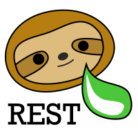

# Spring CouchRest

[  ](https://bintray.com/hedgehogs-mind/hedgehogs-mind-java/spring-couch-rest/_latestVersion)




<!-- MDTOC maxdepth:6 firsth1:0 numbering:0 flatten:0 bullets:1 updateOnSave:1 -->

- [What is CouchRest](#what-is-couchrest)   
- [Getting started](#getting-started)   
   - [1. Add dependency](#1-add-dependency)   
   - [2. Enable CouchRest](#2-enable-couchrest)   
      - [Via an annotation](#via-an-annotation)   
      - [Manually](#manually)   
   - [3. Configuration](#3-configuration)   
   - [4. Level up your first entity!](#4-level-up-your-first-entity)   
      - [Entity level](#entity-level)   
      - [Repository level](#repository-level)   
- [Further reading](#further-reading)   

<!-- /MDTOC -->

## What is CouchRest

CouchRest is a plugin for Spring. It enables you to publish resources very fast via REST.

This project is in its early days, so there are still a lot of features to implement.

*__It requires at minimum Java 11.__*

## Getting started

### 1. Add dependency

The artifact is currently hosted on JCenter.

Gradle users:

```
repositories {
    jcenter()
}

...

dependencies {
    implementation 'com.hedgehogs-mind:spring-couch-rest'
}
```

Maven users:

```
<repositories>
    <repository>
        <id>jcenter</id>
        <name>jcenter</name>
        <url>https://jcenter.bintray.com</url>
    </repository>
</repositories>

...

<dependency>
	<groupId>com.hedgehogs-mind</groupId>
	<artifactId>spring-couch-rest</artifactId>
	<version>0.0.1-ALPHA</version>
	<type>pom</type>
</dependency>
```

### 2. Enable CouchRest

In this section, we will show you, how you can enable CouchRest in your Spring (Boot) Application. After this step,
CouchRest runs but will still throw an error, because we need to add a configuration. This is done in the next step!

#### Via an annotation

Take your Spring Boot Application class and open it. Add the annotation `@EnableCouchRest` to the class.

```
...
import com.hedgehogsmind.springcouchrest.annotations.EnableCouchRest;
...

@SpringBootApplication
@EnableCouchRest
public class MySpringBootApplication {

	public static void main(String[] args) {
		SpringApplication.run(MySpringBootApplication.class, args);
	}

}
```

#### Manually

You can also configure the required beans manually. You need to configure the following beans:

- `CouchRestCore`
- `CouchRestHandlerMapping`
- `CouchRestHandlerAdapter`

`@EnableCouchRest` does nothing else than importing these classes into the Spring Application (scan).

### 3. Configuration

After enabling CouchRest, you probably instantly started your application. In case I'm right,
you experienced the following error:

```
Caused by: com.hedgehogsmind.springcouchrest.beans.exceptions.NoConfigurationFoundException: No CouchRestConfiguration found.
	at com.hedgehogsmind.springcouchrest.beans.CouchRestCore.fetchCouchRestConfiguration(CouchRestCore.java:87) ~[main/:na]
	at com.hedgehogsmind.springcouchrest.beans.CouchRestCore.setup(CouchRestCore.java:64) ~[main/:na]
	...
```

__You need to provide a `CouchRestConfiguration` Bean!__ For convenience, you can extend the `CouchRestConfigurationAdapter`.

*For our first demo, we will disable all security restrictions.* __This is not recommended for normal usage!__ Please
revert this later. Also read the [security documentation](security.md)!

Here is an example:

```
@Component
public class MyCouchRestConfiguration
       extends CouchRestConfigurationAdapter {

    @Override
    public String getBaseSecurityRule() {
        return "permitAll()";
    }

    @Override
    public String getDefaultEndpointSecurityRule() {
        return "permitAll()";
    }

}
```

For more on that checkout the [configuration docs](configuration.md) as well as the [security docs](security.md).

### 4. Level up your first entity!

#### Entity level

Just add the annotation `@CouchRest` to an entity like this:

```
@Entity
@CouchRest
public class Note {

    @Id
    @GeneratedValue
    public int id;

    @Column
    public String title;

    @Column
    @Lob
    public String content;

}
```

__You can now perform `GET /api/note` and you will get all note instances!__

#### Repository level

You can also publish a resource via a repository by just adding the annotation `@CouchRest` again:

```
@Repository
@CouchRest
public interface AddressRepository extends CrudRepository<Address, Long> {

}

@Entity
public class Address {

    @Id
    @GeneratedValue
    public long id;

    @Column
    public String street;

    @Column
    public String nr;

    @Column
    public String zip;

    @Column
    public String town;

}
```

## Further reading

Go ahead and read the following documentation pages, to better understand, what CouchRest is capable of:

- [CRUD operations for entities](docs/usage/crud_operations.md)
- [Configuration of CouchRest](docs/usage/configuration.md)
- [Security](docs/usage/security.md)
- [Logging](docs/usage/logging.md)
- [Changelog](docs/technical/changelog.md)
- [Roadmap](docs/future/roadmap.md)
