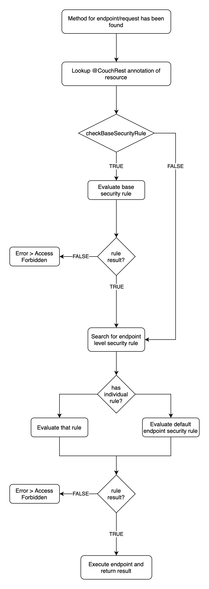

# Security with CouchRest

CouchRest emphasizes security a lot. This is done by specifying SpringEL expressions. Most often you will want
to query a Spring Security state.

In this document we will cover the basics of CouchRest's security concept and how you can control the security
restrictions.

<!-- MDTOC maxdepth:6 firsth1:0 numbering:0 flatten:0 bullets:1 updateOnSave:1 -->

- [Request rejection](#request-rejection)   
- [Rule interpretation](#rule-interpretation)   
- [Security flow](#security-flow)   
- [SpringEL expressions for rules](#springel-expressions-for-rules)   
   - [Where are expressions defined](#where-are-expressions-defined)   
   - [Default expressions](#default-expressions)   
   - [Extend expressions](#extend-expressions)   
   - [Further customization](#further-customization)   
- [Rule definitions](#rule-definitions)   
   - [Base Security](#base-security)   
   - [Default endpoint security rule](#default-endpoint-security-rule)   
   - [CRUD Security](#crud-security)   

<!-- /MDTOC -->

## Request rejection

Generally: In case a request will be rejected by any security rule we explain in this document,
a 403 response will be sent to the client.

## Rule interpretation

All security rules must be written as SpringEL expressions. They shall produce a boolean result.
The result will be interpreted as follows:

- `true`: Access check succeeded, and the request will be handled.
- `false`: Access check failed, and the request will be rejected.

## Security flow

The following image shows CouchRest's two stage security model. If you prefer a textual description,
skip the image, there is a transcription of what the image shows.



Security flow explained in words:

When a method/endpoint handler has been found for a request, that handler will be executed by Spring MVC at some point.
When the handler starts executing, CouchRest checks the access privilege of the client.

First CouchRest checks the `@CouchRest` annotation of the resource the request targets.
In case the argument `checkBaseSecurityRule` of the `@CouchRest` annotation is true,
CouchRest will evaluate the base security rule specified in the `CouchRestConfiguration`.
If the result is true, CouchRest proceeds. If it is false, CouchRest will return an
"access forbidden" error to the client.

In case the argument `checkBaseSecurityRule` is false, CouchRest will just skip that step.

After handling the base security rule stuff (security stage one), CouchRest checks, if the endpoint/target method
has an own security rule defined by the developer/you. In case there is one, it will be evaluated. If not,
the default endpoint security rule specified in the `CouchRestConfiguration` will be evaluated.

Either way: If the result of the evaluated rule is true, CouchRest executes the rest of the endpoint handler
and returns the result to the client. If the result is false, an "access forbidden" error will be sent to the
client. That was the last stage – security stage two.

## SpringEL expressions for rules

Here we will explain the most important expressions which are available for rules. We will also discuss, how
you can extend the dictionary of expressions!

### Where are expressions defined

While evaluating a security rule written in SpringEL, the SpringEL evaluation root object is used. So
if you try to call the method `isSomeoneThere()` in your expression, the evaluator tries to execute a method
named `isSomeoneThere` of the root object.

By default, this root object is of type `CouchRestSpelRoot`. It implements Spring Security's interface
`SecurityExpressionOperations` and thus provides the most common expressions you probably already know
from Spring Security.

This root object can be replaced/extended in the `CouchRestConfiguration`. More on that later in "Extend expressions".

### Default expressions

Simple rules:
- `permitAll()`: Always returns true.
- `denyAll()`: Always returns false.

Getters:

- `getAuthentication()` or `authentication`: Retrieves the current authentication from Spring Security's request context. Could return null.
- `getPrincipal`: Returns principal of authentication. Can return null, if authentication is null.
- `getAuthorities()` or `authorities`: List of authorities of the current authentication. Empty if there is no authentication.
- `getRoles()` or `roles`: Returns alls authorities with the prefix `getRolePrefix()` (by default "ROLE_").

Permission checkers:
- `hasAuthority(String authority)`: Checks if the current authentication, if present, has the given authority (returns true), or not (returns false).
- `hasAnyAuthority(String... authorities)`: Returns true, if `hasAuthority()` returns true for at least one of the given authorities.
- `hasRole(String role)`: Same as `hasAuthority()` but for roles (with role prefix).
- `hasAnyRole(String... roles)`: Sames as `hasAnyAuthority()` but for roles (with role prefix).
- `hasPermission(Object target, Object permission)`: Delegates call to PermissionEvaluator with current authentication.
- `hasPermission(Object targetId, String targetType, Object permission)`: Delegates call to PermissionEvaluator with current authentication.

State checkers:
- `isAnonymous()`: Asks the AuthenticationTrustResolver if the current authentication is anonymous or not.
- `isAuthenticated()`: If there currently is an authentication object, the result of its method `isAuthenticated()` will be returned. Otherwise false.
- `isRememberMe()`: Asks the AuthenticationTrustResolver if the current authentication has the "remember me" flag turned on.
- `isFullyAuthenticated()`: Returns true if neither remember me is turned on nor if the authentication is anonymous. Otherwise false.

### Extend expressions

You may want to add own expressions. Therefore, you need to extend the SpringEL evaluator root object. Please ensure
your read the section "Where are expressions defined".

Take your `CouchRestConfiguration` and override the method `getSpringElEvaluationRootObject()`. There you can either
return an extended class or an instance of `CouchRestSpelRoot` with additional methods via anonymous inner
declaration.

__Super important note/tip:__ *The root object will be autowired* by CouchRest. This means, that you can use dependency injection
via the Constructor or `@Autowired` fields or setters!

Example using anonymous inner declaration:

```
@Component
public class MyCouchRestConfig
       extends CouchRestConfigurationAdapter {

    ...

    @Override
    public Optional<Object> getSpringElEvaluationRootObject() {
        return new CouchRestSpelRoot() {

            public void isSuperUser() {
                // Here you can literally do everything you want
                return getAuthentication() instanceOf MySuperUserClass;
            }

        };
    }

    ...

}
```

### Further customization

Within the section "Default expressions" you may have heart of "AuthenticationTrustResolver", "PermissionEvaluator" or
"Role prefix". The first two are Spring Security elements used for evaluating states of the current authentication.

AuthenticationTrustResolver: By default an instance of `AuthenticationTrustResolverImpl` will be used. In case there
is a bean within the Spring application context, it will be injected via dependency injection, and it will be used
instead of the default instance (remember what we said about the root object earlier:
it will be autowired by CouchRest).

PermissionEvaluator: By default an instance of `DenyAllPermissionEvaluator` will be used. If you want an
own permission evaluator, replace/extend the root object as described earlier and overwrite the method
`getPermissionEvaluator()`. It is recommended to instantiate an instance only once and return that instance in the
getter.

Role prefix: You may use an other role prefix other than `ROLE_`. Just extend/replace the root object and
overwrite the method `getRolePrefix()`.

## Rule definitions

### Base Security

You can specify a global security rule for all CouchRest endpoints.

This is done by Specifying a base security rule in SpringEL in your `CouchRestConfiguration`:

```
@Component
public class MyCouchRestConfig
       extends CouchRestConfigurationAdapter {

    ...

    @Override
    public String getBaseSecurityRule() {
        return "isAuthenticated() && hasAuthority('API_USER')";
    }

    ...

}
```

__I encourage you__ to choose a rather restrictive base rule.

_Hint:_ Checking the base security rule can be disabled by setting the argument `checkBaseSecurityRule`
of the resource's `@CouchRest` annotation to `false`.

### Default endpoint security rule

Within CouchRest you can always define endpoint/method level security rules. They represent the second security
stage. In case you have not specified an own rule for an endpoint, a default endpoint rule will be checked.

This default endpoint rule must be defined in the CouchRestConfiguration:

```
@Component
public class MyCouchRestConfig
       extends CouchRestConfigurationAdapter {

    ...

    @Override
    public String getDefaultEndpointSecurityRule() {
        return "denyAll()";
    }

    ...

}
```

__As always: As restrictive as possible!__

### CRUD Security

The annotation `@CouchRest` on a Repository or an Entity class publishes the (corresponding) Entity via Rest.
It creates endpoints for creating entities of that type, fetching and deleting them. You can specify security rules
for each of that methods individually.

__In case you did not specify an individual rule for a method, the default endpoint security rule will be used!__

To declare individual security rules for the CRUD functionalities, you add the annotation `@CrudSecurity` to your
Entity or Repository you already annotated with `@CouchRest` and specify the rules via the annotation
arguments. Here is an example:

```
@CouchRest
@CrudSecurity(
    read = "isAuthenticated() && hasAuthority('READ_NOTE')",
    saveUpdate = "isAuthenticated() && hasAuthority('SAVE_NOTE')",
    delete = "isAuthenticated() && hasAuthority('DELETE_NOTE')"
)
public class Note {

    @Id
    @GeneratedValue
    public long id;

    @Column
    public String content;

}
```

The rules explained in more detail:
- `read`: This rule secures "GET all" and "GET one by id" requests.
- `saveUpdate`: This rule secures "POST new" and "POST update by id" requests.
- `delete`: This rule secures "DELETE by id" requests.
